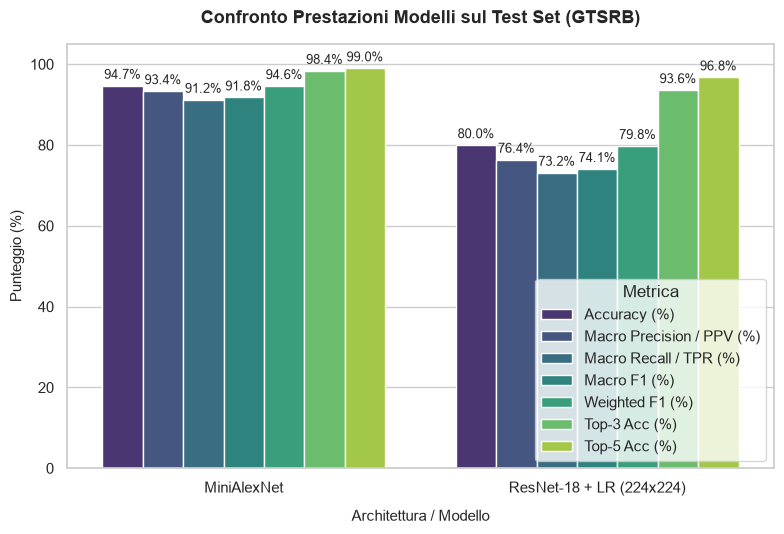
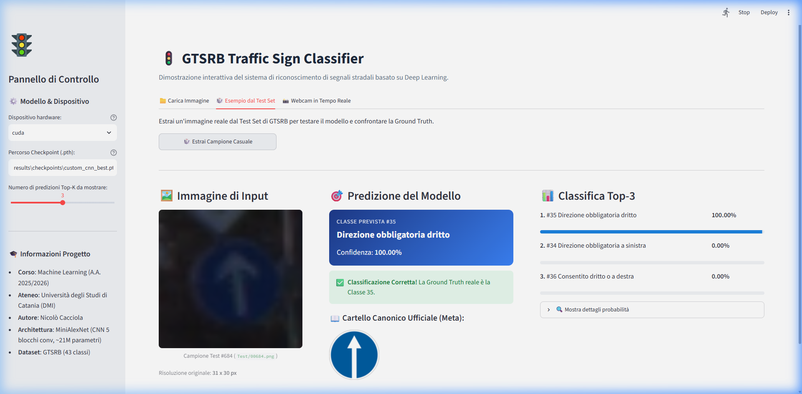

# Comparazione di modelli di Machine Learning per la classificazione di segnali stradali (GTSRB)

Progetto per l'esame di **Machine Learning** del Corso di Laurea Magistrale in Informatica, Dipartimento di Matematica e Informatica (D.M.I.), **Università degli Studi di Catania**, Anno Accademico 2025/2026.

---

## 📌 Informazioni sul Progetto

- **Autore**: Nicolò Cacciola
- **Titolo**: *Benchmarking e classificazione di segnali stradali tedeschi (GTSRB): confronto comparativo tra Transfer Learning / Feature Extraction e Deep Learning end-to-end*
- **Dataset**: [German Traffic Sign Recognition Benchmark (GTSRB)](https://www.kaggle.com/datasets/meowmeowmeowmeowmeow/gtsrb-german-traffic-sign) — 43 classi, oltre 50.000 immagini a risoluzione variabile.
- **Modello di punta**: `MiniAlexNet` (CNN custom a 5 stadi convoluzionali, input 48x48) — **94.69% Test Accuracy**, **99.01% Top-5 Accuracy**.

---

## 📂 Struttura del Progetto

La struttura della directory rispetta le convenzioni standard definite per il corso:

```text
unict-ml-year-25-nickcacciola/
│
├── data/                  # Dataset GTSRB (Train.csv, Test.csv, Meta.csv, cartelle Train/Test/Meta)
│
├── docs/                  # Documentazione e report scientifico finale
│   ├── report.md          # Relazione tecnica completa del progetto (Markdown)
│   ├── report.pdf         # Relazione tecnica impaginata e pronta per la consegna (PDF)
│   └── report-template.md # Template originale di riferimento fornito dal corso
│
├── media/                 # Grafici dei risultati, matrici di confusione e visualizzazioni
│   ├── class_distribution.png              # Distribuzione frequenze classi Train vs Test
│   ├── confusion_matrix_minialexnet.png     # Matrice di confusione normalizzata 43x43
│   ├── custom_dataset_sample.png           # Verifica tensoriale del caricamento PyTorch
│   ├── model_comparison_bars.png           # Grafico a barre comparativo di tutti i modelli
│   ├── sample_roi_meta_analysis.png        # Ispezione del campione originale con crop ROI
│   ├── streamlit_demo_layout.png           # Schermata layout dell'applicazione Streamlit
│   ├── streamlit_demo_prediction.png       # Schermata di inferenza live con verifica Ground Truth
│   └── top4_misclassified_analysis.png     # Analisi delle categorie più frequentemente errate
│
├── notebooks/             # Jupyter Notebook esplorativo e narrativo
│   └── project.ipynb      # Analisi esplorativa dei dati (EDA), training ed esperimenti
│
├── results/               # Risultati numerici, pesi addestrati e log di TensorBoard
│   ├── checkpoints/       # Miglior checkpoint salvato (custom_cnn_best.pth)
│   ├── logs/              # Event logs per il monitoraggio di curve di loss e accuracy
│   └── final_model_comparison.csv # Tabella comparativa delle metriche
│
├── src/                   # Moduli sorgente riutilizzabili del progetto
│   ├── dataset.py         # Download, estrazione, classe PyTorch CustomGTSRB
│   ├── metrics.py         # Calcolo metriche multiclasse (Accuracy, Macro/Weighted F1, Top-k)
│   ├── models.py          # Definizione di MiniAlexNet, backbone ResNet-18, inferenza CNN
│   ├── train.py           # Training loop con AverageValueMeter, checkpointing e TensorBoard
│   └── utils.py           # Verifica GPU e dizionario ufficiale delle 43 classi StVO
│
├── demo.py                # Applicazione Web interattiva in Streamlit
├── main.py                # Interfaccia a riga di comando (CLI) per train, eval e demo
├── requirements.txt       # Dipendenze Python e librerie richieste
└── README.md              # Questo file
```

---

## 📊 Sintesi dei Risultati Sperimentali

Tutti i modelli sono stati valutati sul **Test Set ufficiale GTSRB** (12.630 immagini non viste in addestramento):

| Modello | Input Shape | Accuracy | Macro F1 | Weighted F1 | Top-3 Acc | Top-5 Acc | Note |
| :--- | :---: | :---: | :---: | :---: | :---: | :---: | :--- |
| **MiniAlexNet (Custom CNN)** | $48 \times 48$ | **94.69%** | **91.80%** | **94.62%** | **98.38%** | **99.01%** | **Miglior modello complessivo (End-to-End)** |
| **ResNet-18 + Logistic Regression** | $224 \times 224$ | 79.99% | 74.10% | 79.78% | 93.61% | 96.77% | Feature Extractor pre-trained su ImageNet |
| **ResNet-18 + Random Forest (100 alberi)** | $224 \times 224$ | 64.77% | 50.48% | 62.28% | 85.23% | 92.37% | OOB Accuracy: 85.24% |
| **ResNet-18 + Logistic Regression** | $48 \times 48$ | 60.21% | 51.16% | 59.96% | 83.67% | 92.15% | Penalizzato da downsampling e perdita di risoluzione |

<p align="center">
  
</p>

> **Osservazione chiave**: L'architettura `MiniAlexNet`, pur essendo addestrata da zero con soli ~21M di parametri, supera ampiamente il feature extractor ResNet-18 (+14.7% di accuracy). Questo accade perché i filtri convoluzionali di MiniAlexNet si adattano specificamente alle caratteristiche geometriche e ai colori dei segnali stradali, laddove il primo layer conv $7 \times 7$ con stride 2 di ResNet-18 tende a distruggere la risoluzione spaziale originale delle icone.

---

## 🛠️ Come usare il repository

### 1. Clonazione del repository e creazione dell'ambiente virtuale

```bash
git clone https://github.com/nickcacciola/unict-ml-year-25-nickcacciola.git
cd unict-ml-year-25-nickcacciola

# Creazione dell'ambiente virtuale (consigliato Python 3.10 o 3.11)
python -m venv .venv

# Attivazione ambiente:
# Su Windows (PowerShell):
.venv\Scripts\Activate.ps1
# Su Linux / macOS:
source .venv/bin/activate

# Installazione dei requisiti
pip install -r requirements.txt
```

---

### 2. Valutazione rapida dei modelli pre-addestrati (Replicabilità 1-Click)

Per verificare immediatamente i risultati e generare le metriche e la matrice di confusione sul Test Set senza dover ri-addestrare:

```bash
python main.py --mode eval
```

Questo comando caricherà il miglior checkpoint salvato in `results/checkpoints/custom_cnn_best.pth`, calcolerà tutte le metriche sul Test Set e salverà la matrice di confusione in `media/confusion_matrix_minialexnet.png`.

---

### 3. Avvio della Demo Interattiva (Streamlit Web App)

Per testare i modelli in tempo reale tramite interfaccia grafica:

```bash
streamlit run demo.py
```

*(Oppure tramite CLI: `python main.py --mode demo`)*

La web app offre:

- **Caricamento file**: Trascina un'immagine locale `.png` o `.jpg`.
- **Esempio casuale dal Test Set**: Estrae un campione dal set di test e ne verifica automaticamente la correttezza rispetto alla Ground Truth.
- **Scatto da Webcam**: Per inquadrare e classificare segnali stradali in tempo reale.
- **Confronto visivo**: Mostra l'immagine predetta affiancata al cartello canonico da catalogo ufficiale StVO (`data/Meta/`).

<p align="center">
  
</p>

---

### 4. Addestramento di MiniAlexNet da zero

Se desideri rieseguire la pipeline di addestramento e validazione:

```bash
python main.py --mode train --epochs 10 --batch_size 64 --lr 0.001
```

Durante il training:

- Lo split Train/Validation (80/20) viene calcolato in modo **stratificato** per preservare la distribuzione delle classi.
- I pesi con la migliore validation accuracy vengono salvati automaticamente in `results/checkpoints/custom_cnn_best.pth`.
- Tutti gli scalari (Loss e Accuracy per epoca) vengono salvati nella cartella `results/logs/`.

---

### 5. Monitoraggio con TensorBoard

Per visualizzare in tempo reale o a posteriori l'andamento delle curve di apprendimento:

```bash
tensorboard --logdir results/logs
```

E aprire il browser all'indirizzo `http://localhost:6006`.

---

### 6. Esplorazione e Diario Sperimentale: Jupyter Notebook (`notebooks/project.ipynb`)

Oltre alla pipeline modulare (`src/`) e all'interfaccia a riga di comando (`main.py`), il repository include il notebook interattivo completo:
📁 **[`notebooks/project.ipynb`](notebooks/project.ipynb)**

Per avviarlo ed esplorarlo interattivamente:

```bash
jupyter notebook notebooks/project.ipynb
```

---

## 📃 Documentazione e Relazione

La documentazione formale del progetto è disponibile sia in formato Markdown che in PDF impaginato pronto per la consultazione o la stampa:

- 📄 **Relazione Completa (Markdown)**: [`docs/report.md`](docs/report.md)
- 📑 **Relazione Ufficiale Impaginata (PDF)**: [`docs/report.pdf`](docs/report.pdf)
- 📝 **Template di riferimento del corso**: [`docs/report-template.md`](docs/report-template.md)
