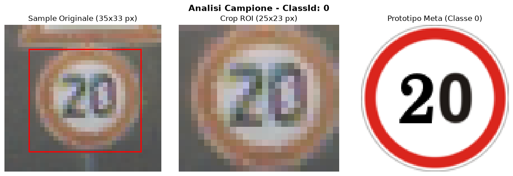
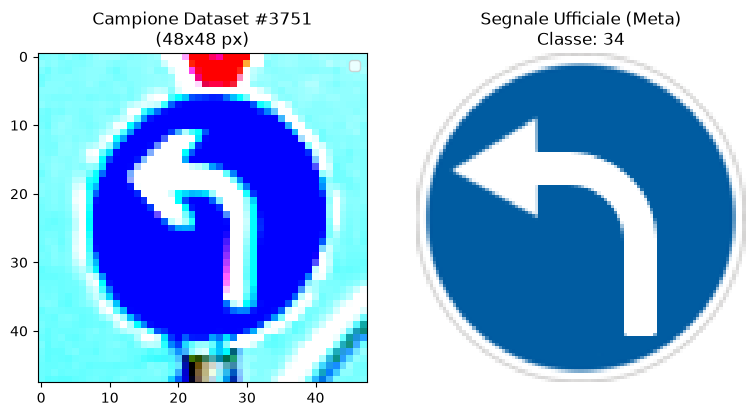
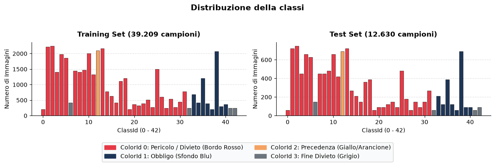
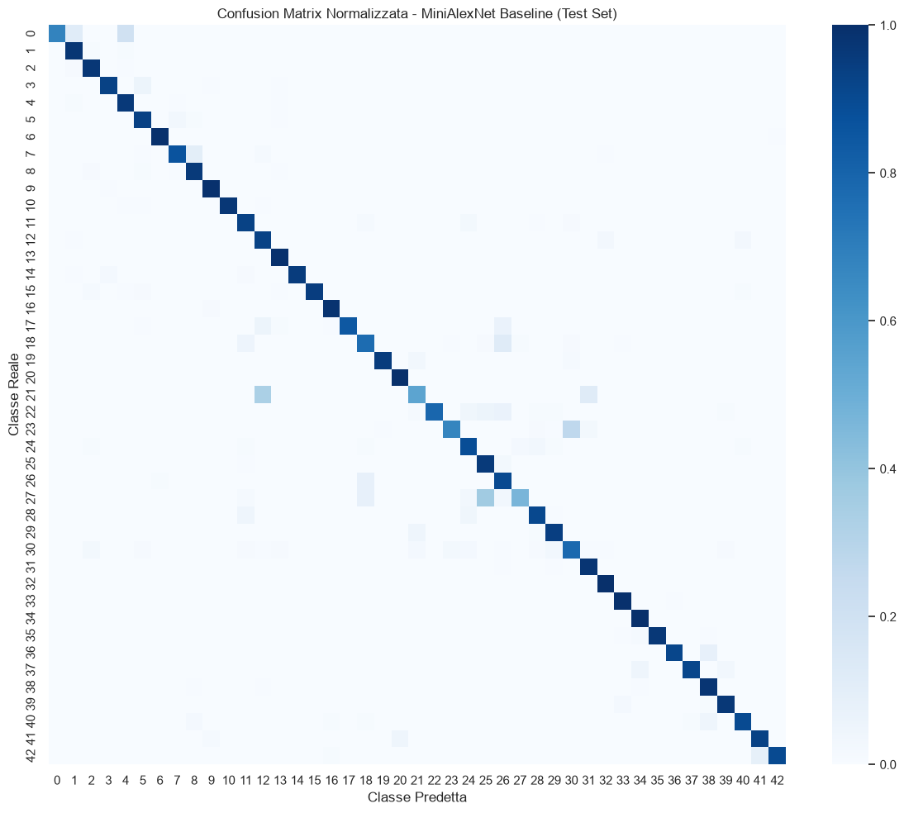
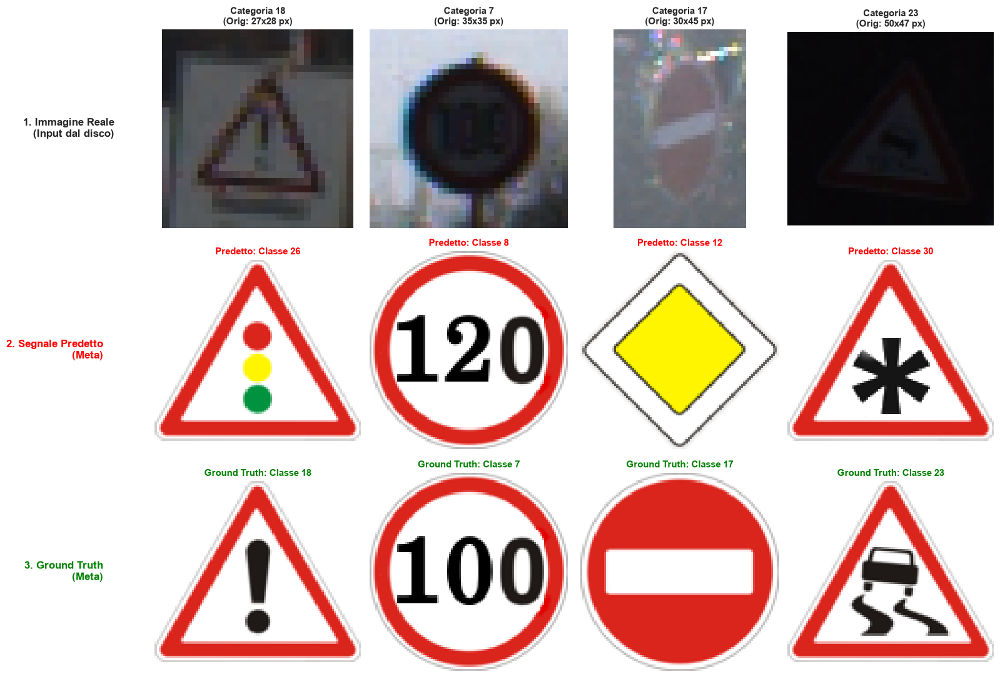
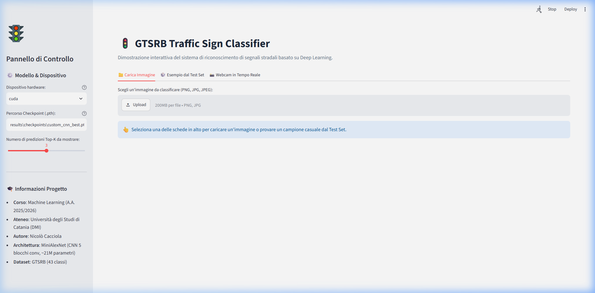

# Classificazione e Benchmarking di Segnali Stradali (GTSRB): Analisi Comparativa tra Feature Extraction Basata su Transfer Learning e Deep Learning Convoluzionale End-to-End

## Gruppo

- **Anno Accademico**: 2025/2026
- **Corso**: Machine Learning (Laurea Magistrale in Informatica, D.M.I., Università degli Studi di Catania)
- **Membro**: Nicolò Cacciola, Matricola #1000054971

---

## Abstract

Il presente lavoro affronta il problema della classificazione automatica di cartelli stradali multiclasse ($K=43$) a partire dal benchmark pubblico **German Traffic Sign Recognition Benchmark (GTSRB)**. Nel lavoro sono stati confrontati sia paradigmi classici di Machine Learning (Logistic Regression e Random Forest), applicati a rappresentazioni latenti ad alto livello estratte da una rete convoluzionale pre-addestrata (**ResNet-18** su ImageNet), sia un'architettura Deep Learning convoluzionale personalizzata (**MiniAlexNet**) addestrata *end-to-end* sul dominio target.

L'analisi esplorativa preliminare evidenzia una forte eterogeneità di risoluzione delle immagini ($25\times 25$ fino a oltre $260\times 230$ pixel) e un marcato sbilanciamento di classe (Imbalance Ratio $\approx 10.71$, Entropia Normalizzata $H_{norm} \approx 0.945$). Negli esperimenti, MiniAlexNet raggiunge le prestazioni migliori con un'**Accuracy del 94.69%**, **Macro F1 del 91.80%**, **Weighted F1 del 94.62%** e **Top-5 Accuracy del 99.01%**, superando ampiamente i modelli basati su feature extraction (+14.7% di accuratezza rispetto a ResNet-18 + LR).

---

## 1. Introduzione

### 1.1 Contesto del Problema

Il riconoscimento automatico della segnaletica stradale (*Traffic Sign Recognition*, TSR) rappresenta uno dei moduli cardine nei moderni sistemi avanzati di assistenza alla guida (**ADAS**) e nei veicoli a guida autonoma (**AV**). In scenari operativi reali, un sistema TSR deve soddisfare requisiti stringenti:

1. **Accuratezza e robustezza**: operare in condizioni avverse di illuminazione, occlusioni parziali, gestire il domain shift.
2. **Gestione del bilanciamento di classe**: riconoscere con elevata affidabilità sia i cartelli ad alta frequenza statistica (es. limiti di velocità e precedenze) sia segnali rari ma critici per la sicurezza (es. pericoli generici o cantieri).

### 1.2 Obiettivi del Progetto

Gli obiettivi perseguiti in questo progetto comprendono:

1. **Analisi esplorativa formale (EDA)**: caratterizzazione statistica della distribuzione spaziale e frequenziale delle 43 classi di segnali stradali tedeschi del dataset GTSRB, calcolando metriche formali di sbilanciamento (Imbalance Ratio, Entropia di Shannon, Degree of Imbalance).
2. **Progettazione di una pipeline di preprocessing e data loading**: implementazione di una classe `Dataset` personalizzata in PyTorch (`CustomGTSRB`) per standardizzare le immagini a risoluzione fissa ($48 \times 48$ pixel) e applicare normalizzazioni statistiche.
3. **Indagine empirica su due paradigmi di apprendimento**:
    - *Transfer Learning via Feature Extraction*: estrazione di vettori di feature a 512 dimensioni tramite spina dorsale ResNet-18 congelata, combinata con classificatori discriminativi (Logistic Regression multinomiale e Random Forest).
    - *Deep Learning End-to-End*: progettazione e addestramento supervisionato da zero di una rete convoluzionale dedicata (**MiniAlexNet**).
4. **Valutazione multiclasse standardizzata**: confronto rigoroso su Test Set non visibile in training tramite metriche bilanciate (Macro Precision, Macro Recall, Macro F1, Weighted F1, Top-3 e Top-5 Accuracy) e analisi della Matrice di Confusione.
5. **Realizzazione di un'interfaccia utente (Demo)**: sviluppo di una Web Application interattiva (Streamlit) per il deploy locale del modello.

### 1.3 Ruolo del Jupyter Notebook e Metodologia Sperimentale

A corredo della presente relazione e del codice modulare organizzato nei package `src/`, il repository include il notebook interattivo completo: [`notebooks/project.ipynb`](../notebooks/project.ipynb).

La consultazione del notebook riveste un ruolo centrale per comprendere appieno le scelte progettuali.

---

## 2. Dataset

### 2.1 Descrizione e Fonte del Dataset

Il dataset utilizzato è il **German Traffic Sign Recognition Benchmark (GTSRB)**. Il dataset è accessibile pubblicamente su [Kaggle](https://www.kaggle.com/datasets/meowmeowmeowmeowmeow/gtsrb-german-traffic-sign).

Il corpus è composto da oltre **50.000 immagini** a colori (RGB) organizzate in 43 classi. La partizione dei dati include:

- **Training Set grezzo**: 39.209 annotazioni (`Train.csv`), suddivise in 43 sottocartelle numerate da `0` a `42`.
- **Test Set ufficiale**: 12.630 annotazioni (`Test.csv`), contenente sequenze indipendenti per la valutazione finale.
- **Metadati**: `Meta.csv` e cartella `Meta/`, che associa a ogni classe le caratteristiche geometriche (forma, colore, identificativo StVO) e l'icona grafica vettoriale/ideale.

Ogni record dei file CSV comprende: dimensioni dell'immagine originale (`Width`, `Height`), coordinate del rettangolo che ritaglia il segnale (`Roi.X1`, `Roi.Y1`, `Roi.X2`, `Roi.Y2`), etichetta della classe (`ClassId`) e percorso relativo dell'immagine (`Path`).

*Figura 1: Esempio di annotazione GTSRB con confronto tra immagine originale, ritaglio ROI e segnale prototipo (Meta).*

### 2.2 Preprocessing e Data Loading

Evidenziamo due aspetti centrali del lavoro sul preprocessing dei dati:

1. **Eterogeneità di risoluzione**: le immagini originali presentano dimensioni fortemente eterogenee, comprese tra $25 \times 25$ pixel e oltre $260 \times 230$ pixel. Per quanto riguarda i metodi basati sul feature extractor ResNet-18, le immagini sono state ridimensionate a $224 \times 224$ pixel (la risoluzione nativa di ImageNet su cui la backbone è stata pre-addestrata). Per MiniAlexNet, invece, le immagini sono state uniformate alla risoluzione target di $48 \times 48$ pixel.
2. **Normalizzazione e scaling**: tutte le immagini sono state normalizzate mediante le trasformazioni di `torchvision.transforms.v2`, impiegando la media e la deviazione standard del dominio ImageNet. Per i modelli di Logistic Regression, particolarmente sensibili alla scala numerica delle feature, sui vettori di embedding prodotti da ResNet-18 è stato inoltre applicato uno standardizzatore (`StandardScaler`) fittato esclusivamente sulle rappresentazioni del training set per prevenire fenomeni di data leakage.

Per gestire il caricamento efficiente dei campioni è stata sviluppata la classe personalizzata `CustomGTSRB` ([src/dataset.py](../src/dataset.py)), derivata da `torch.utils.data.Dataset`. La classe incapsula la lettura on-demand dei file PNG tramite `torchvision.io.decode_image`, l'applicazione delle trasformazioni `torchvision.transforms.v2` e l'estrazione delle label intere.

*Figura 2: Verifica del caricamento tensoriale tramite la classe CustomGTSRB con confronto del prototipo ufficiale.*

### 2.3 Analisi Statistica dello Sbilanciamento delle Classi

La distribuzione delle frequenze delle 43 classi nel training set è fortemente eterogenea: alcune classi (es. limiti di 30 km/h o 50 km/h) contengono oltre 2.000 campioni, mentre classi rare (es. segnali di strettoia o pericolo ghiaccio) contano circa 210 istanze.

Per quantificare rigorosamente il grado di sbilanciamento sono state calcolate tre metriche formali (la cui derivazione analitica e visualizzazione interattiva sono consultabili sia nel notebook [`notebooks/project.ipynb`](../notebooks/project.ipynb) sia nel modulo [`src/metrics.py`](../src/metrics.py)):

1. **Imbalance Ratio (IR)**:
   $$IR = \frac{\max_{i} N_i}{\min_{i} N_i} = \frac{2250}{210} \approx 10.71$$
   Il rapporto pari a 10.71 evidenzia che la classe a massima numerosità possiede oltre dieci volte il volume di campioni della classe meno rappresentata.

2. **Entropia di Shannon Normalizzata ($H_{norm}$)**:
   $$H = - \sum_{i=0}^{K-1} p_i \log_2(p_i), \quad H_{max} = \log_2(43) \approx 5.4263$$
   $$H_{norm} = \frac{H}{H_{max}} = \frac{5.1278}{5.4263} \approx 0.9450$$
   Un valore di entropia normalizzata prossimo a 1 indica che, pur in presenza di disparità di frequenza locale, l'informazione è distribuita sull'intero spazio delle classi senza collassare su pochi monopolisti.

3. **Degree of Imbalance ($D$)**:
   $$D = 1 - H_{norm} \approx 0.0550$$
   *(Nel caso ideale perfettamente bilanciato: $IR = 1.0$, $H_{norm} = 1.0$, $D = 0.0$)*.

*Figura 3: Distribuzione empirica del numero di campioni per classe ($K=43$) nel Training Set (39.209 istanze) e nel Test Set (12.630 istanze).*

### 2.4 Metodo di Split

Per scongiurare il fenomeno del *data leakage* e preservare fedelmente le proporzioni di ogni classe tra train e validation, il file `Train.csv` (39.209 campioni) è stato ripartito mediante uno **split stratificato 80/20** fissando il generatore di numeri casuali (`random_state=42`, `stratify=df_train_full["ClassId"]`):

- **Training Set interno**: 31.367 campioni (80%).
- **Validation Set interno**: 7.842 campioni (20%).
- **Test Set ufficiale**: 12.630 campioni indipendenti (non toccati durante il training o la selezione degli iperparametri).

---

## 3. Metodologia

Il progetto esplora e mette a confronto sistematico due approcci architetturali profondamente diversi:

### 3.1 Approccio A: Feature Extraction con ResNet-18

In questo schema viene sfruttata una spina dorsale **ResNet-18** pre-addestrata su ImageNet ([src/models.py](../src/models.py)). L'ultimo layer lineare di classificazione ($1000$ classi) viene rimosso, convertendo la rete in un estrattore deterministico di feature vettoriali:
$$\mathbf{x} \in \mathbb{R}^{3 \times H \times W} \xrightarrow{\text{ResNet-18 Backbone}} \mathbf{z} \in \mathbb{R}^{512}$$

I vettori di embedding estratti vengono quindi standardizzati e utilizzati come input per modelli di Machine Learning classici:

1. **Logistic Regression Multinomiale (Softmax Regression)**:
    - Risoluzione $48 \times 48$ pixel.
    - Risoluzione $224 \times 224$ pixel (risoluzione nativa di ResNet-18).
2. **Random Forest Classifier**:
    - 100 estimatori (alberi decisionali), valutazione Out-Of-Bag (`oob_score=True`), parallelizzazione su tutti i core CPU (`n_jobs=-1`).

### 3.2 Approccio B: MiniAlexNet (CNN Custom End-to-End)

Per superare i limiti dell'adattamento di feature generiche pre-addestrate su scene naturali, è stata progettata un'architettura convoluzionale dedicata, denominata **MiniAlexNet** ([src/models.py](../src/models.py)), ispirata ai principi cardine di AlexNet ma riscalata per l'input $48 \times 48$ pixel a 43 classi.

L'architettura si articola in due macro-sezioni:

#### 1. Feature Extractor Convoluzionale

- **Conv Block 1**: `Conv2d(3 -> 16, kernel=5, pad=2)` $\rightarrow$ `MaxPool2d(2)` $\rightarrow$ `ReLU` (Output: $16 \times 24 \times 24$)
- **Conv Block 2**: `Conv2d(16 -> 32, kernel=5, pad=2)` $\rightarrow$ `MaxPool2d(2)` $\rightarrow$ `ReLU` (Output: $32 \times 12 \times 12$)
- **Conv Block 3**: `Conv2d(32 -> 64, kernel=3, pad=1)` $\rightarrow$ `ReLU` (Output: $64 \times 12 \times 12$)
- **Conv Block 4**: `Conv2d(64 -> 128, kernel=3, pad=1)` $\rightarrow$ `ReLU` (Output: $128 \times 12 \times 12$)
- **Conv Block 5**: `Conv2d(128 -> 256, kernel=3, pad=1)` $\rightarrow$ `MaxPool2d(2)` $\rightarrow$ `ReLU` (Output: $256 \times 6 \times 6$)

#### 2. Classificatore Denso (Fully Connected)

- **Flatten**: $256 \times 6 \times 6 = 9.216$ feature scalari.
- **FC 6**: `Linear(9216 -> 2048)` $\rightarrow$ `ReLU`
- **FC 7**: `Linear(2048 -> 1024)` $\rightarrow$ `ReLU`
- **FC 8 (Output)**: `Linear(1024 -> 43)` $\rightarrow$ Logits grezzi per la Cross-Entropy Loss.

### 3.3 Iperparametri e Procedura di Addestramento

L'addestramento di MiniAlexNet è stato eseguito per **10 epoche** su GPU NVIDIA GeForce GTX 1050 Ti con le seguenti specifiche:

- Funzione di costo: **Cross-Entropy Loss Multiclasse**
- Ottimizzatore: **Adam** con learning rate $\eta = 10^{-3}$
- Dimensione del batch: $B = 64$
- Monitoraggio metriche: accumulatore ponderato `AverageValueMeter` per tracciare accuratamente loss e accuratezza batch-by-batch sia in training che in validation.
- Checkpointing: salvataggio automatico dello stato del modello (`custom_cnn_best.pth`) solo al raggiungimento di un nuovo massimo di Validation Accuracy.
- Logging: integrazione continua con **TensorBoard** (`SummaryWriter`) per il tracciamento degli scalari di loss e accuratezza per epoca.

---

## 4. Esperimenti e Risultati

### 4.1 Metriche di Valutazione Scelte

Data la marcata asimmetria tra le classi, l'accuratezza globale (*Accuracy*) da sola non rappresenta una misura sufficiente. Sono state pertanto adottate le seguenti metriche:

- **Accuracy (%)**: proporzione totale di previsioni esatte.
- **Macro Precision (%) & Macro Recall (%)**: medie aritmetiche non pesate di precisione e sensitività su ciascuna delle 43 classi.
- **Macro F1-Score (%)**: media armonica non pesata tra precision e recall:
    $$\text{Macro } F1 = \frac{1}{K} \sum_{i=0}^{K-1} F1_i$$
    Assegna lo stesso peso ($1/43$) a ogni classe, evidenziando impietosamente eventuali fallimenti sulle classi rare.

- **Weighted F1-Score (%)**: media degli F1-score ponderata sul numero reale di campioni (*support*) di ogni classe nel test set.
- **Top-3 e Top-5 Accuracy (%)**: probabilità che la classe corretta si trovi tra le prime 3 o 5 ipotesi con confidenza più elevata.

### 4.2 Tabella Comparativa dei Risultati

Tutti i modelli sono stati testati sullo stesso Test Set ufficiale GTSRB (12.630 immagini):

| Modello | Risoluzione | Accuracy | Macro Prec. | Macro Rec. | Macro F1 | Weighted F1 | Top-3 Acc | Top-5 Acc |
| :--- | :---: | :---: | :---: | :---: | :---: | :---: | :---: | :---: |
| **MiniAlexNet (Custom CNN)** | $48 \times 48$ | **94.69%** | **93.36%** | **91.22%** | **91.80%** | **94.62%** | **98.38%** | **99.01%** |
| **ResNet-18 + Logistic Regression** | $224 \times 224$ | 79.99% | 76.40% | 73.16% | 74.10% | 79.78% | 93.61% | 96.77% |
| **ResNet-18 + Random Forest (100 alberi)** | $224 \times 224$ | 64.77% | 64.90% | 47.90% | 50.48% | 62.28% | 85.23% | 92.37% |
| **ResNet-18 + Logistic Regression** | $48 \times 48$ | 60.21% | 52.08% | 50.71% | 51.16% | 59.96% | 83.67% | 92.15% |

*Figura 4: Confronto prestazionale tra MiniAlexNet (CNN custom) e ResNet-18 + Logistic Regression (224x224) sulle diverse metriche di valutazione.*

### 4.3 Analisi Critica e Interpretazione dei Risultati

Dall'analisi incrociata dei dati sperimentali emergono importanti evidenze metodologiche:

1. **Superiorità Netta dell'Approccio End-to-End**:
   MiniAlexNet supera il miglior modello basato su feature extraction (ResNet-18 a $224 \times 224$) di **+14.70% in Accuracy** e di **+17.70% in Macro F1**. Nonostante ResNet-18 sia una rete profonda con pesi pre-addestrati su oltre 1.2 milioni di immagini, tali feature riflettono concetti visivi generici (animali, oggetti comuni). I filtri di MiniAlexNet, invece, si specializzano sui segnali stradali.

2. **L'Impatto Critico della Risoluzione su ResNet-18**:
   A risoluzione $48 \times 48$, ResNet-18 fallisce vistosamente (60.21% di accuratezza). Portando l'input a $224 \times 224$ tramite upscaling, l'accuratezza risale al 79.99% (+19.78%).

3. **Confronto tra Classificatori Lineari e Random Forest**:
   Sul vettore di embedding a 512 dimensioni, la Logistic Regression supera nettamente il Random Forest (79.99% contro 64.77%).

4. **Il Divario tra Macro F1 e Weighted F1**:
   In tutti i modelli, il punteggio di Weighted F1 è sistematicamente superiore al Macro F1 (in MiniAlexNet: 94.62% vs 91.80%). Questo divario di quasi 3 punti percentuali è la diretta conseguenza dello sbilanciamento delle classi: il modello performa con accuratezza eccezionale sulle classi con supporto massiccio (dove l'F1-score supera il 97%), mentre accusa qualche incertezza isolata sulle classi con meno di 100 campioni nel test set.

### 4.4 Analisi degli Errori e Matrice di Confusione

Dall'ispezione della Matrice di Confusione normalizzata, la diagonale principale si presenta nettamente dominante:

*Figura 5: Matrice di confusione normalizzata per classe ($43 \times 43$) per il modello MiniAlexNet sul Test Set ufficiale.*

Tuttavia, l'analisi delle classi con il tasso d'errore più elevato rivela pattern di confusione chiari e interpretabili:

*Figura 6: Campioni reali delle 4 categorie più frequentemente misclassificate da MiniAlexNet, con confronto visivo tra immagine d'ingresso, prototipo predetto ed etichetta reale (Ground Truth).*

- **Classi 21 e 22 (Doppia curva vs Strada deformata)**: entrambi segnali triangolari di pericolo con sfondo bianco e bordi rossi, la cui icona interna (ondeggiante) differisce per dettagli a bassa risoluzione.
- **Confusioni tra limiti di velocità**: alcune immagini di Classe 0 (20 km/h) vengono confuse con Classe 1 (30 km/h) o Classe 4 (70 km/h) a causa di occlusione parziale o motion blur che rende poco leggibile la prima cifra.
- Ciononostante, la **Top-5 Accuracy del 99.01%** certifica che in oltre 99 casi su 100 la classe corretta si trova tra le primissime ipotesi del modello, rendendolo idoneo all'impiego in sistemi gerarchici o con conferma temporale (tracciamento multi-frame).

---

## 5. Demo Interattiva

A corredo della parte sperimentale è stata sviluppata un'applicazione interattiva completa mediante il framework **Streamlit** ([demo.py](../demo.py)).

### 5.1 Caratteristiche dell'Interfaccia Grafica

L'interfaccia si suddivide in un pannello laterale di controllo (sidebar) e un'area operativa a schede con tre modalità di acquisizione:

1. **Caricamento Immagine Locale (Tab 1)**: l'utente può trascinare un file d'immagine arbitrario (`.png`, `.jpg`, `.jpeg`).
2. **Campione Casuale dal Test Set (Tab 2)**: consente di estrarre con un click un'immagine casuale dal file `data/Test.csv`. L'applicazione esegue l'inferenza e verifica automaticamente se la previsione coincide con la **Ground Truth**, evidenziando l'esito con badge dinamici (`✅ Corretta` o `❌ Errata`).
3. **Acquisizione in Tempo Reale da Webcam (Tab 3)**: mediante `st.camera_input`, permette di testare cartelli stradali inquadrati direttamente dal vivo.

*Figura 7: Panoramica dell'interfaccia Web interattiva (Streamlit) con pannello laterale di configurazione hardware/modello e area a schede per l'acquisizione dei campioni.*

### 5.2 Elementi Informativi Visualizzati

Per ciascuna predizione, la Web App calcola e restituisce:

- L'**immagine originale** con dimensioni native in pixel.
- La **predizione primaria (Top-1)** con nome del cartello in lingua italiana conforme StVO e percentuale di confidenza (es. `99.24%`).
- Il **cartello canonico di riferimento** caricato dal catalogo vettoriale `data/Meta/{ClassId}.png`, offrendo un riscontro visivo immediato all'utente.
- Il **grafico a barre interattivo delle Top-K classi candidate** con le relative probabilità Softmax.

*Figura 8: Esempio di classificazione in tempo reale su campione del Test Set (#684): riscontro visivo positivo (Ground Truth coincidente), prototipo ufficiale e probabilità Top-3.*

### 5.3 Ottimizzazioni Tecniche

Il caricamento di MiniAlexNet e dei pesi pre-addestrati è gestito tramite il decoratore `@st.cache_resource`, garantendo che il modello rimanga residente nella memoria del server o della GPU e azzerando la latenza nei test successivi.

---

## 6. Conclusioni e Sviluppi Futuri

### 6.1 Sintesi del Lavoro Svolto

Il progetto ha permesso di analizzare a fondo la problematica della classificazione di segnali stradali, confrontando metodologie consolidate di Machine Learning classico con paradigmi di Deep Learning convoluzionale end-to-end. I risultati dimostrano che:

1. Le reti convoluzionali addestrate *end-to-end* sul dominio specifico (**MiniAlexNet**, 94.69% accuracy) risultano ampiamente superiori al transfer learning basato su feature extraction congelata, a parità di risoluzione nativa.
2. Lo sbilanciamento di classe richiede una valutazione sfaccettata basata su Macro F1 e Top-k accuracy, per evitare letture distorte legate esclusivamente all'accuratezza globale.

### 6.2 Idee per Sviluppi Futuri

Tra i possibili miglioramenti e sviluppi futuri si individuano:

- **Data Augmentation Adattiva**: applicazione di tecniche di *AutoAugment*, rotazioni casuali, variazioni fotometriche e deformazioni prospettiche per regolarizzare ulteriormente la CNN e migliorare l'F1-score sulle classi a bassa frequenza.
- **Tecniche di Mitigazione dello Sbilanciamento**: sperimentazione della *Focal Loss* o di pesi inversamente proporzionali alla frequenza nella Cross-Entropy Loss per penalizzare maggiormente gli errori sui campioni rari.
- **Prevenzione dell'Overfitting e Regolarizzazione**: i risultati particolarmente positivi conseguiti da MiniAlexNet sul test set ufficiale suggeriscono comunque l'opportunità di valutarne la generalizzabilità su dataset esterni o in condizioni ambientali inedite (es. pioggia, nebbia o guida notturna). Per scongiurare potenziali fenomeni di overfitting e incrementare la robustezza, sviluppi futuri prevedono l'integrazione di tecniche di regolarizzazione quali *Dropout* (previsto nell'architettura originale di AlexNet sui layer completamente connessi, ma omesso in questa versione compatta per mantenere snello il modello e accelerare la convergenza), *Weight Decay* ($L_2$ regularization) ed *Early Stopping* supervisionato sulla validation loss.

---

## 7. Riferimenti Bibliografici e Strumenti

1. **J. Stallkamp, M. Schlipsing, J. Salmen, and C. Igel**, *"Man vs. computer: Benchmarking machine learning algorithms for traffic sign recognition"*, Neural Networks, vol. 32, pp. 323–332, 2012.
2. **K. He, X. Zhang, S. Ren, and J. Sun**, *"Deep Residual Learning for Image Recognition"*, Proceedings of the IEEE Conference on Computer Vision and Pattern Recognition (CVPR), pp. 770–778, 2016.
3. **A. Krizhevsky, I. Sutskever, and G. E. Hinton**, *"ImageNet Classification with Deep Convolutional Neural Networks"*, Communications of the ACM, vol. 60, no. 6, pp. 84–90, 2017.
4. **PyTorch Team**, *PyTorch: An Imperative Style, High-Performance Deep Learning Library*, NeurIPS, 2019.
5. **Scikit-learn Developers**, *Scikit-learn: Machine Learning in Python*, JMLR 12, pp. 2825–2830, 2011.
6. **Streamlit Inc.**, *Streamlit: The fastest way to build and share data apps*, <https://streamlit.io/>, 2026.
